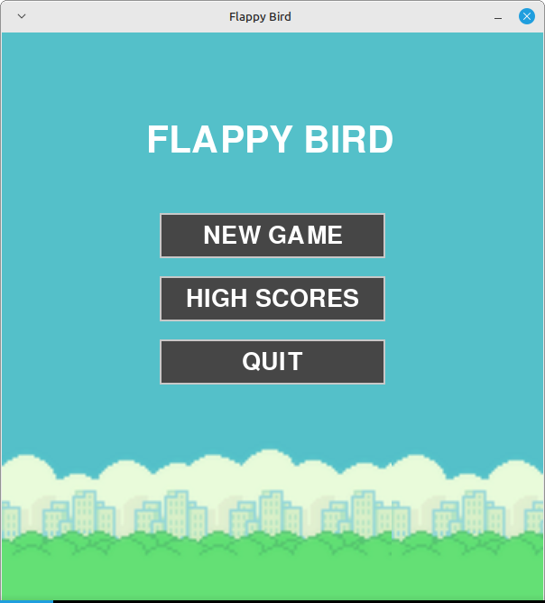

# Flappy Bird Clone

A Python implementation of the classic Flappy Bird game using Pygame.


## Features

-   Classic Flappy Bird gameplay with familiar mechanics
-   Main menu with navigation options
-   Player name customization
-   High score tracking using SQLite database
-   Game over screen with highest scores
-   Simple, responsive controls

## Screenshots

### Main Menu



### Name Input Screen


### Gameplay


### Game Over Screen


### High Scores Screen


## Requirements

-   Python 3.6+
-   Pygame 2.0+
-   SQLite3 (included with Python)

## Installation

1. Clone this repository or download the source code
2. change directory
    ```
    cd flappy_bird
    ```
3. Create a virtual environment and activate it
    ```
    python3 -m venv .venv
    source .venv/bin/activate #linux
    .venv/Scripts/activate #windows
    ```
4. Install the required dependencies:
    ```
    pip3 install pygame
    ```
5. Run the game:
    ```
    python3 flappy_bird.py
    ```

## How to Play

1. From the main menu, click "New Game"
2. Enter your name and press Enter
3. Control the bird by pressing the spacebar or clicking with the mouse to make it flap
4. Navigate through the pipes without touching them
5. Each pipe passed adds one point to your score
6. When you lose, your score is saved and the game over screen appears
7. Choose to play again with the same name or return to the main menu

## Game Structure

The game consists of several screens:

1. **Main Menu**: Features three buttons:

    - New Game - Starts a new game session
    - High Scores - Shows the top 10 high scores
    - Quit - Exits the game

2. **Name Input**: Allows the player to enter their name before starting

3. **Game Screen**: The actual Flappy Bird gameplay

4. **Game Over Screen**: Shows your score, the all-time highest score, and options to:

    - Play Again - Start a new game with the same player name
    - Main Menu - Return to the main menu

5. **High Scores Screen**: Displays the top 10 scores from the database

## Database Schema

The game uses SQLite to store scores with a simple schema:

```sql
CREATE TABLE scores (
    name TEXT NOT NULL,
    score INTEGER NOT NULL,
);
```

## Project Structure

```
flappy_bird/
├── main.py              # Main game file
├── img/                 # Sprites and background images
├── database.py          # Database handling functions
├── game.py              # Core game mechanics
├── button.py            # button class
├── bird.py              # Player character logic
├── pipe.py              # Pipe generation and movement
├── constants.py         # all constants
└── flappy_scores.db     # SQLite database file
```

## Future Improvements

-   Different difficulty levels
-   Character customization
-   Background themes
-   Power-ups and special abilities
-   Online leaderboard

## Credits

-   Game inspired by the original Flappy Bird by Dong Nguyen
